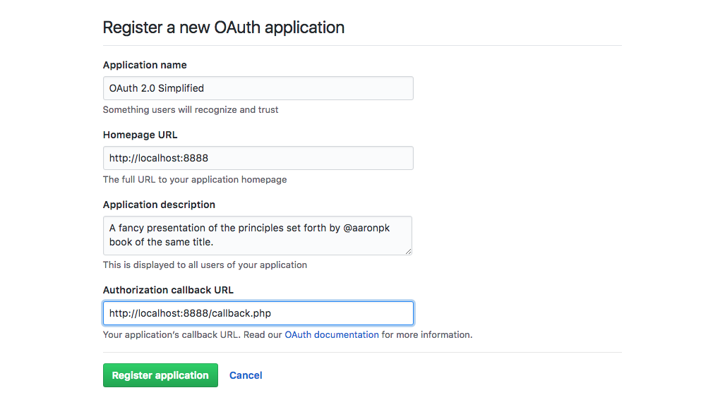

# OAuth 2.0 Simplified
A fancy presentation of the principles set forth by [@aaronpk](https://twitter.com/aaronpk) book of the same title.

### For more information
* [Aaron Parecki](https://github.com/aaronpk/sample-oauth2-client) `aaronpk/sample-oauth2-client.git `
* Based on the book: [OAuth 2.0 Simplified](https://oauth2simplified.com/)
* [GitHub OAuth Documentation](https://developer.github.com/apps/building-oauth-apps/understanding-scopes-for-oauth-apps/)

## Initial Setup
- Create an OAuth App with [GitHub](https://github.com/settings/developers)


- Register client application


- Store Client Id and Client Secret on `lib/clientData.php`


- Clone the repository, configure it and run it.
`php -S localhost:8888`

# Codebase 
This is writen from what I remembered and what I wrote down on my notes during Aaron's event at 2018 the [Nürnberg Digital Festival](https://nuernberg.digital/festival/programm/2018/understanding-and-implementing-oauth-2-0-mit-aaron-parecki-42/).
Feel free to fork it. But this example of OAuth 2 is the Server-Side Flow it's just to get your public GitHub Repo list.

#### Point of Entry (oauth-20-simplified.php)
Your starting file is named after the repository. This script created a variable `$loginLink` that's used to assemble your login link; feel free to rename to `index.php` in your local dev environment.

```
/* oauth-20-simplified.php */

{
    'client_id'    => , // value stored in `lib/clientData.php`
    'redirect_uri' => , // location to return to
    'scope'        => , // Refer to the GitHub Documentation
    'state'        =>   // Random number generator
}

/* Example of Login Button
<a class="btn" href="<?= $loginLink; ?>">OAuth Login</a>
```

### Callback 
When GitHub authenticates you, you'll get a code to exachange for a token. This is where you both request it and store it to the Session. You will be required to proceed in this example. Feel free to fork it. You will use the Client Secret, which is specific to this Server-Side Flow approach.
```
/* callback.php */
/** @var string $tokenRequest */
$tokenData = json_decode($tokenRequest);

// Store the token 
$_SESSION['access_token'] = $tokenData->access_token;
```

### App 
With the `access_token` saved to the session, you can now use it to make request to the GitHub API. Notice that the curl request on this file is to the GitHub API and not GitHub OAuth Autherize like in previous files. 
- Loops `$repos` and builds an ordered list
```
/* app.php */

// Included in the curl request handers
CURLOPT_HTTPHEADER => [
    'Accept: application/json',
    'User-Agent: http://localhost:8888',
    'Authorization: Bearer '.$_SESSION['access_token']
]
```

I hope this gets your started with OAuth. Want to learn more, read the [book](https://oauth2simplified.com/).

